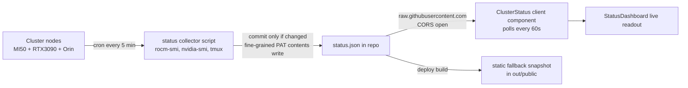

# Portfolio v2 — Massive Improvements Plan

**Status: PROPOSAL — no changes until approved**
Baseline: site live at l064n.github.io, static export, 4 routes, MDX notes, 3D hero, 161 kB first load.

## Key decisions (confirmed with user)
1. **Domain**: user owns `logan.dev` → point the site there (CNAME + DNS), keep `l064n.github.io` as fallback.
2. **Status feed**: live cluster data via a collector on the cluster pushing `public/status.json` to this repo; client fetches fresh copy from `raw.githubusercontent.com` (which sends `CORS: *`) so the site updates **without a full deploy**.
3. Projects move from hardcoded `lib/data.ts` into the MDX pipeline so they get deep-dive pages like notes do.

## Live status feed architecture

- `deploy.yml` gets `paths-ignore: ['public/status.json', 'legacy-2020/**']` so status pushes don't trigger full site rebuilds.
- Fallback: if fetch fails (offline, rate-limited), dashboard renders the bundled snapshot with a `stale` indicator.
- PAT lives only on the cluster, never in the repo (fine-grained, single repo, contents:write).

## Phases

### Phase 1 — SEO & identity foundation
- Create `public/`: `favicon.svg` (terminal prompt motif), `apple-icon.png`, `robots.txt`, static OG image (terminal-styled, 1200×630).
- Per-route metadata: `generateMetadata` for `/notes/[slug]` (title, summary→description, canonical, OG) and static metadata for every other route. All canonicals use `siteConfig.url` (logan.dev).
- Static `app/sitemap.ts` (all routes incl. notes/tags/projects) + RSS feed at `/notes/feed.xml` (route handler, static at build time).
- Terminal-styled 404 page: `$ open /unknown` → `bash: ...: No such file or directory`.
- Add `CNAME` file (`logan.dev`); DNS steps documented in README.
- Remove `.DS_Store` from git, fix `.gitignore`.

### Phase 2 — Live cluster status feed
- `status/collect.sh` (runs on cluster via cron/systemd): gathers per-GPU name, util %, temp, memory, power draw + node role/uptime → `public/status.json`; `git pull --rebase`, commit-if-changed, push with PAT.
- Committed default snapshot in `public/status.json`.
- `components/home/ClusterStatus.tsx` (client): polls raw.githubusercontent every 60s, 10s timeout, animated GPU util bars, temps, "updated Xm ago", stale fallback.
- Integrate into `StatusDashboard`; `paths-ignore` in deploy workflow.

### Phase 3 — Project deep-dive pages
- Migrate 4 projects from `lib/data.ts` into `content/projects/*.mdx` (frontmatter = current fields; body = long-form writeup with diagrams/photos where available).
- `lib/projects.ts` reads project MDX frontmatter (same pattern as `lib/mdx.ts`); update FilterBar, CommandPalette, RecentActivity to consume it.
- `app/projects/[slug]/page.tsx`: title, role, impact callout, stack pills, MDX body, prev/next, per-project metadata.
- `ProjectCard` becomes a link to its detail page.

### Phase 4 — Notes reading experience
- Reading progress bar (thin accent line, top of viewport, client scroll listener).
- Sticky TOC on desktop: headings extracted at build time, active-section tracking via IntersectionObserver.
- Prev/next note navigation + "Related notes" (shared tags, max 2) at article end.
- Per-tag index pages `/notes/tag/[tag]` (generateStaticParams); tag chips on posts and in the notes sidebar link to them.
- `BlogPosting` JSON-LD per note.

### Phase 5 — Search & navigation polish
- Command palette: notes indexed with title + tags + summary + body excerpt (full text is small; embeds in a lazy chunk), so ⌘K finds content, not just titles.
- Visible search trigger in the header (icon + ⌘K hint) so mobile users can open the palette.
- `MotionConfig reducedMotion="user"` in root layout; 3D scene honors `prefers-reduced-motion` (static pose, no parallax).
- `theme-color` meta, scroll-restoration on route change.

### Phase 6 — Hygiene, CI, docs
- New `ci.yml`: `npm run lint` + `npx tsc --noEmit` on PRs (needs `eslint` + `eslint-config-next` devDeps).
- Remove `legacy-2020/` from the working tree (stays in git history); confirm nothing references it.
- README rewrite: architecture overview, domain/DNS setup, cluster status daemon setup (PAT scopes, cron line), how to add a note/project.
- Final pass: Lighthouse on desktop + mobile, verify all routes + feed + sitemap live.

## Verification per phase
Each phase ends with: build → commit → push → wait for Pages deploy → curl-verify affected routes/assets.

## Out of scope (for now)
- Live blog comments, custom analytics beyond a privacy-friendly counter, i18n, mobile app/PWA manifest (could be a quick follow-up).
